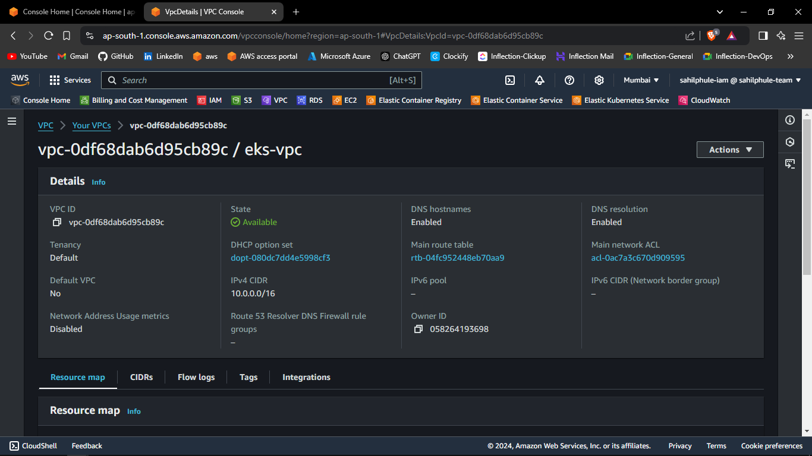
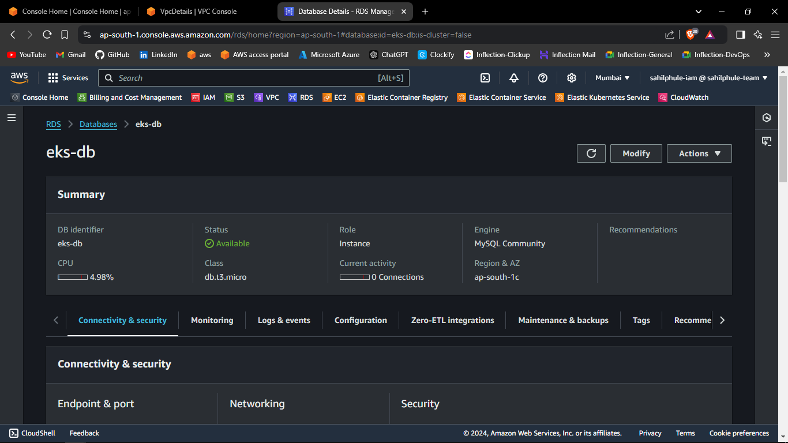
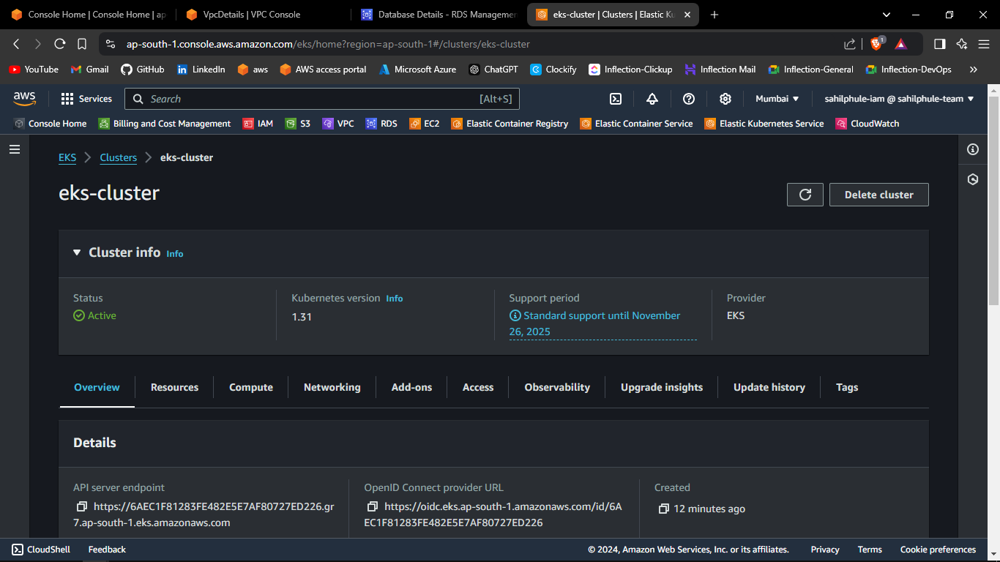
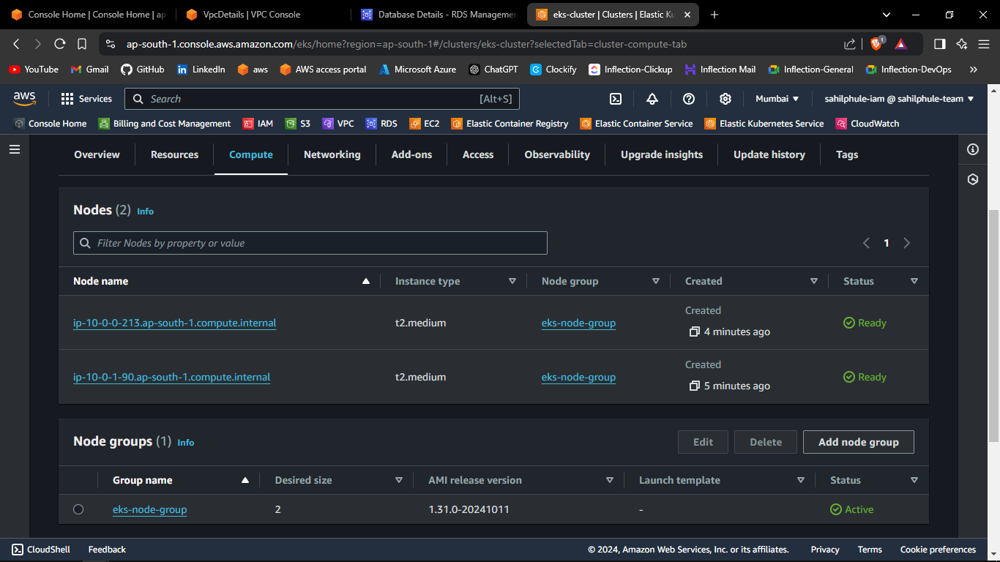
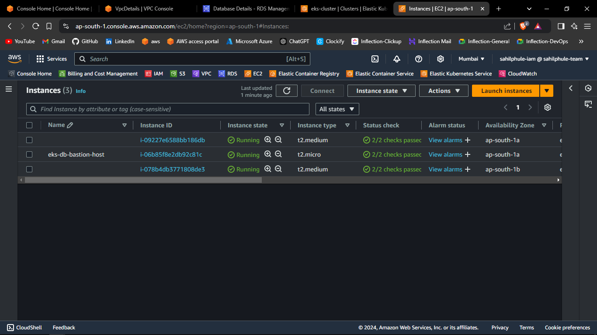

# AWS EKS Deployment using Pulumi

## Prerequisites
1. AWS Account with IAM user having sufficient permissions.
2. AWS CLI installed and configured with the IAM user.
3. Pulumi Installed.

---

## Code
Create Pulumi Project directory.

## Data Definition
1. Inside Pulumi Project, create *data.py* file.
2. Import the following:
    - pulumi_aws as aws
3. Call the following functions:
    - aws.ec2.get_ami()
4. The reference code is attached below.

```py
import pulumi_aws as aws

linux_ami = aws.ec2.get_ami(
    most_recent = True,
    owners = ["137112412989"],

    filters = [
        {
            "name": "name",
            "values": ["al2023-ami-2023.5.20240819.0-kernel-6.1-x86_64"]
        },
        {
            "name": "virtualization-type",
            "values": ["hvm"]
        }
    ]
)
```

5. The definition of *data.py* is complete.

---

## VPC Definition
1. Inside Pulumi Project, create *vpc.py* file.
2. Import the following:
    - pulumi_aws as aws
    - values
3. Call the following functions:
    - aws.ec2.Vpc()
    - aws.get_availability_zones()
    - for public
        - aws.ec2.InternetGateway()
        - aws.ec2.RouteTable()
        - aws.ec2.Subnet()
        - aws.ec2.RouteTableAssociation()
    - for private
        - aws.ec2.RouteTable()
        - aws.ec2.Subnet()
        - aws.ec2.RouteTableAssociation()
4. The reference code is attached below.

```py
import pulumi_aws as aws
import values

vpc = aws.ec2.Vpc(
    'vpc',
    
    cidr_block = '10.0.0.0/16',
    instance_tenancy = 'default',
    enable_dns_hostnames = True,
    enable_dns_support = True,

    tags = {
        'Name': values.vpc_properties["vpc-name"]
    }
)

igw = aws.ec2.InternetGateway(
    'vpc-igw',

    vpc_id = vpc.id,
    
    tags = {
        'Name': values.vpc_properties['vpc-igw-name']
    }
)

vpc_public_rt = aws.ec2.RouteTable(
    'vpc-public-rt',
    
    vpc_id = vpc.id,
    routes = [
        aws.ec2.RouteTableRouteArgs(
            cidr_block = '0.0.0.0/0',
            gateway_id = igw.id,
        )
    ],
    
    tags={
        'Name': values.vpc_properties['vpc-public-rt-name']
    }
)

vpc_private_rt = aws.ec2.RouteTable(
    'vpc-private-rt',

    vpc_id = vpc.id,

    tags = {
        'Name': values.vpc_properties['vpc-private-rt-name']
    }
)

# Subnets, one for each AZ in a region
zones = aws.get_availability_zones()
public_subnet_ids = []
private_subnet_ids = []

for zone in zones.names:
    vpc_public_subnet = aws.ec2.Subnet(
        f'vpc-public-subnet-{zone}',
        
        vpc_id = vpc.id,
        cidr_block = f'10.0.{len(public_subnet_ids)}.0/24',
        availability_zone = zone,
        map_public_ip_on_launch = True,

        tags = {
            'Name': f'{values.vpc_properties["vpc-public-subnet-name"]}-{zone}'
        }
    )

    vpc_private_subnet = aws.ec2.Subnet(
        f'vpc-private-subnet-{zone}',

        vpc_id = vpc.id,
        cidr_block = f'10.0.{len(private_subnet_ids)+100}.0/24',
        availability_zone = zone,

        tags = {
            'Name': f'{values.vpc_properties["vpc-private-subnet-name"]}-{zone}'
        }
    )

    aws.ec2.RouteTableAssociation(
        f'vpc-public-rt-assoc-{zone}',
        
        route_table_id = vpc_public_rt.id,
        subnet_id = vpc_public_subnet.id
    )

    aws.ec2.RouteTableAssociation(
        f'vpc-private-rt-assoc-{zone}',

        route_table_id = vpc_private_rt.id,
        subnet_id = vpc_private_subnet.id
    )

    public_subnet_ids.append(vpc_public_subnet.id)
    private_subnet_ids.append(vpc_private_subnet.id)
```

5. The definition of *vpc.py* is complete.

---

## RDS Definition
1. Inside Pulumi Project, create *rds.py* file.
2. Import the following:
    - pulumi
    - pulumi_aws as aws
    - vpc
    - data
    - values
3. Call the following functions:
    - for database
        - aws.rds.SubnetGroup()
        - aws.ec2.SecurityGroup()
        - aws.rds.Instance()
    - for bastion-host
        - aws.ec2.SecurityGroup()
        - aws.ec2.KeyPair()
        - aws.ec2.Instance()
4. Define the following output:
    - DB_HOST
    - bastion-host-ip
5. The reference code is attached below.

```py
import pulumi
import pulumi_aws as aws
import vpc
import data
import values

db_subnet_group = aws.rds.SubnetGroup(
    "db-subnet-group",

    name = values.rds_properties["db-subnet-group-name"],
    subnet_ids = vpc.private_subnet_ids
)

db_sg = aws.ec2.SecurityGroup(
    'db-sg',

    vpc_id = vpc.vpc.id,

    ingress = [
        aws.ec2.SecurityGroupIngressArgs(
            from_port = 3306,
            to_port = 3306,
            protocol = 'tcp',
            cidr_blocks = ['0.0.0.0/0']
        )
    ],

    egress = [
        aws.ec2.SecurityGroupEgressArgs(
            from_port = 0,
            to_port = 0,
            protocol = -1,
            cidr_blocks = ["0.0.0.0/0"]
        )
    ],

    tags = {
        'Name': values.rds_properties['db-sg-name']
    }
)

db = aws.rds.Instance(
    "db",

    identifier = values.rds_properties["db-identifier"],
    allocated_storage = values.rds_properties["db-allocated-storage"],
    engine = values.rds_properties["db-engine"],
    engine_version = values.rds_properties["db-engine-version"],
    instance_class = values.rds_properties["db-instance-class"],
    username = values.rds_properties["db-username"],
    password = values.rds_properties["db-password"],
    publicly_accessible = values.rds_properties["db-publicly-accessible"],
    skip_final_snapshot = values.rds_properties["db-skip-final-snapshot"],
    db_subnet_group_name = db_subnet_group.name,

    vpc_security_group_ids = [
        db_sg.id
    ]
)

bastion_host_sg = aws.ec2.SecurityGroup(
    'bastion-host-sg',

    vpc_id = vpc.vpc.id,

    ingress = [
        aws.ec2.SecurityGroupIngressArgs(
            from_port = 22,
            to_port = 22,
            protocol = 'tcp',
            cidr_blocks = ['0.0.0.0/0']
        )
    ],

    egress = [
        aws.ec2.SecurityGroupEgressArgs(
            from_port = 0,
            to_port = 0,
            protocol = -1,
            cidr_blocks = ['0.0.0.0/0']
        )
    ],

    tags = {
        'Name': values.bastion_properties['bastion-host-sg-name']
    }
)

bastion_host_key_pub_file = open(values.bastion_properties["bastion-host-key-public-file"],"r+")

bastion_host_key_pair = aws.ec2.KeyPair(
    "bastion-host-key-pair",

    key_name = "bastion-host-key-pair",
    public_key = bastion_host_key_pub_file.read()
)

bastion_host = aws.ec2.Instance(
    "bastion-host",

    ami = data.linux_ami.id,
    instance_type = values.bastion_properties["bastion-host-instance-type"],
    key_name = bastion_host_key_pair.id,
    subnet_id = vpc.public_subnet_ids[0],
    vpc_security_group_ids = [
        bastion_host_sg.id
    ],

    tags = {
        'Name': values.bastion_properties["bastion-host-name"]
    }
)

pulumi.export("DB_HOST", db.address)
pulumi.export("bastion-host-ip", bastion_host.public_ip)
```

6. The definition of *rds.py* is complete.

---

## EKS Definition
1. Inside Pulumi Project, create *eks.py* file.
2. Import the following:
    - pulumi_aws as aws
    - vpc
    - values
    - json
3. Call the following functions:
    - aws.iam.Role()
    - aws.iam.RolePolicyAttachment()
    - aws.ec2.SecurityGroup()
    - aws.eks.Cluster()
    - aws.iam.Role()
    - aws.iam.RolePolicyAttachment()
    - aws.iam.RolePolicyAttachment()
    - aws.iam.RolePolicyAttachment()
    - aws.eks.NodeGroup()
4. The reference code is attached below.

```py
import pulumi_aws as aws
import vpc
import values
import json

eks_cluster_role = aws.iam.Role(
    'eks-cluster-role',

    name = values.eks_properties["eks-cluster-role-name"],
    assume_role_policy = json.dumps(
        {
            'Version': '2012-10-17',
            'Statement': [
                {
                    'Action': 'sts:AssumeRole',
                    'Principal': {
                        'Service': 'eks.amazonaws.com'
                    },
                    'Effect': 'Allow'             
                }
            ]
        }
    )
)

aws.iam.RolePolicyAttachment(
    'eks-cluster-role-AmazonEKSClusterPolicy',
    
    role = eks_cluster_role.id,
    policy_arn = 'arn:aws:iam::aws:policy/AmazonEKSClusterPolicy'
)


eks_cluster_sg = aws.ec2.SecurityGroup(
    'eks-cluster-sg',

    vpc_id = vpc.vpc.id,

    ingress = [
        aws.ec2.SecurityGroupIngressArgs(
            from_port = 80,
            to_port = 80,
            protocol = 'tcp',
            cidr_blocks = ['0.0.0.0/0']
        )
    ],
    egress = [
    	{
			"from_port": 0,
			"to_port": 0,
			"protocol": -1,
			"cidr_blocks": ["0.0.0.0/0"]
		}
    ],
    
    tags = {
        'Name': values.eks_properties['eks-cluster-sg-name']
    }
)

eks_cluster = aws.eks.Cluster(
    'eks-cluster',
    
    name = values.eks_properties["eks-cluster-name"],
    role_arn = eks_cluster_role.arn,
    
    vpc_config = aws.eks.ClusterVpcConfigArgs(
        public_access_cidrs = ['0.0.0.0/0'],
        security_group_ids = [
            eks_cluster_sg.id
        ],
        subnet_ids = vpc.public_subnet_ids
    )
)

eks_node_group_role = aws.iam.Role(
    'eks-node-group-role',
    
    name = values.eks_properties["eks-node-group-role-name"],
    assume_role_policy = json.dumps(
        {
            'Version': '2012-10-17',
            'Statement': [
                {
                    'Action': 'sts:AssumeRole',
                    'Principal': {
                        'Service': 'ec2.amazonaws.com'
                    },
                    'Effect': 'Allow',
                }
            ]
        }
    )
)

aws.iam.RolePolicyAttachment(
    'eks-node-group-role-AmazonEKSWorkerNodePolicy',
    
    role = eks_node_group_role.id,
    policy_arn = 'arn:aws:iam::aws:policy/AmazonEKSWorkerNodePolicy'
)


aws.iam.RolePolicyAttachment(
    'eks-node-group-role-cni-policy-attachment',
    
    role = eks_node_group_role.id,
    policy_arn = 'arn:aws:iam::aws:policy/AmazonEKS_CNI_Policy'
)

aws.iam.RolePolicyAttachment(
    'eks-node-group-role-AmazonEC2ContainerRegistryReadOnly',
    
    role = eks_node_group_role.id,
    policy_arn = 'arn:aws:iam::aws:policy/AmazonEC2ContainerRegistryReadOnly'
)

eks_nodegroup = aws.eks.NodeGroup(
    'eks-node-group',
    
    node_group_name = values.eks_properties['eks-node-group-name'],
    cluster_name = eks_cluster.name,
    node_role_arn = eks_node_group_role.arn,

    subnet_ids = vpc.public_subnet_ids,
    instance_types = values.eks_properties["eks-instance-types"],
    
    scaling_config = aws.eks.NodeGroupScalingConfigArgs(
        desired_size = 2,
        max_size = 2,
        min_size = 2
    )
)
```

6. The definition of *eks.py* is complete.

---

## Main Definition
1. Inside Pulumi Project, create *main.py* file.
2. Import the following:
    - vpc
    - rds
    - eks
3. The reference code is attached below.

```py
import vpc
import rds
import eks
```

5. The definition of *main.py* is complete.

---

## Values Definition
1. Inside Pulumi Project, create *values.py* file.
2. Define the following:
    - vpc_properties
    - rds_properties
    - bastion_properties
    - eks_properties
3. The reference code is attached below.

```py
vpc_properties = {
    "vpc-name": "eks-vpc",
    "vpc-igw-name": "eks-vpc-igw",
    "vpc-public-rt-name": "eks-vpc-public-rt",
    "vpc-private-rt-name": "eks-vpc-private-rt",
    "vpc-public-subnet-name": "eks-vpc-public-subnet",
    "vpc-private-subnet-name": "eks-vpc-private-subnet"
}

rds_properties = {
    "db-subnet-group-name": "eks-db-subnet-group",
    "db-sg-name": "eks-db-sg",
    "db-identifier": "eks-db",
    "db-allocated-storage": 10,
    "db-engine": "mysql",
    "db-engine-version": "8.0",
    "db-instance-class": "db.t3.micro",
    "db-username": "root",
    "db-password": "password",
    "db-publicly-accessible": False,
    "db-skip-final-snapshot": True,
}

bastion_properties = {
    "bastion-host-sg-name": "eks-db-bastion-host-sg",
    "bastion-host-key-public-file": "../../../../../../../../../.ssh/bastion-key.pub",
    "bastion-host-instance-type": "t2.micro",
    "bastion-host-name": "eks-db-bastion-host"    
}

eks_properties = {
    "eks-cluster-role-name": "eks-cluster-role",
    "eks-cluster-sg-name": "eks-cluster-sg",
    "eks-cluster-name": "eks-cluster",
    "eks-node-group-role-name": "eks-node-group-role",
    "eks-node-group-name": "eks-node-group",
    "eks-instance-types": ["t2.medium"]
}
```

5. The definition of *values.py* is complete.

---
---

## Provisioning the Infrastructure
Now we will provision the infrastructure by applying the above-created configuration files.

> Ensure AWS CLI is configured with appropriate AWS user credentials and enough permissions.

### Steps:
1. Open the PowerShell.
2. Change the directory to the above-created Pulumi Project.
3. Run the `pulumi new aws-python` command to initialize the *pulumi*.  
4. Provide the appropriate values to prompts such as *project-name*, *project-description*, *stack-name*, *toolchain*, *region-name*, etc.
5. Run the `pulumi up` command and if prompted, select `yes` to provision the infrastructure on to the AWS Cloud. 
6. Head to the AWS Console, and verify the created resources.

## Screenshots of Provisioned Infrastructure

---

### VPC Image


---

### RDS Image


---

### EKS Cluster Image


---

### EKS Node Group Image


---

### EKS Nodes Image


---

## Connect to EKS Cluster from Powershell

1. Open a new Powershell window.
2. Run the following command to configure local kubectl with eks cluster  
    `aws eks --region "region-name" update-kubeconfig --name "cluster-name"`  
    Substitute *region-name* and *cluster-name* with the values defined in the above-created *values.py* file.
3. Now apply the Kubernetes manifest files of the application.
4. To list them all, run `kubectl get all`.

### Powershell Image


5. If a Load Balancer type Service is present then try accessing the External IP of that service in the browser.

### Browser Service Access


---

## Connect to the RDS database through Bastion Host
1. Open MySQL Workbench.
2. Click Add Connection.
3. Select connection method as **Standard TCP/IP over SSH**.
4. In SSH Hostname, enter *bastion-host-ip:22* where bastion-host-ip is received from `pulumi stack output bastion-host-ip` command.
5. In SSH Username, enter *ec2-user*.
6. In SSH Key File, select *bastion-key.pem* file passed in above *values.py* file from your local computer.
7. In MySQL Hostname, enter *DB_HOST* where DB_HOST is received from `pulumi stack output DB_HOST`.
8. In the Password section, select *Store in Vault*, and enter the password passed in above-created *values.py* file.
9. Click *OK* and open the connection.
10. Now you can run mysql commands to access databases, and verify the successful connection of *eks-service*.

---

## Screenshots of MySQL Workbench

---

### Connection Page


---

### Commands Page


---

## Destroy the provisioned infrastructure

1. Firstly, delete all the Kubernetes Deployments.
2. To destroy infrastructure, change directory to the above created Pulumi Project.
3. Run `pulumi destroy` & if prompted, select `yes`.
3. Infrastructure will be destroyed.

---